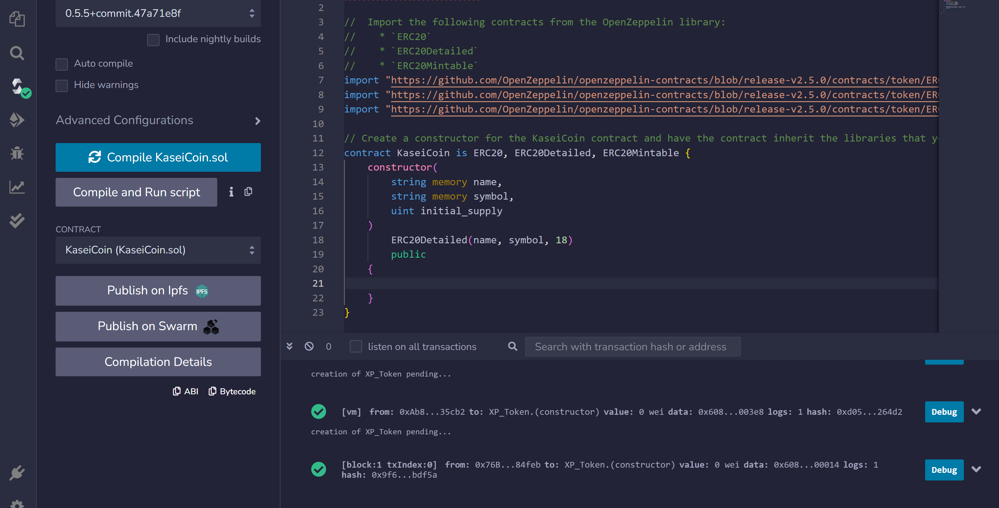
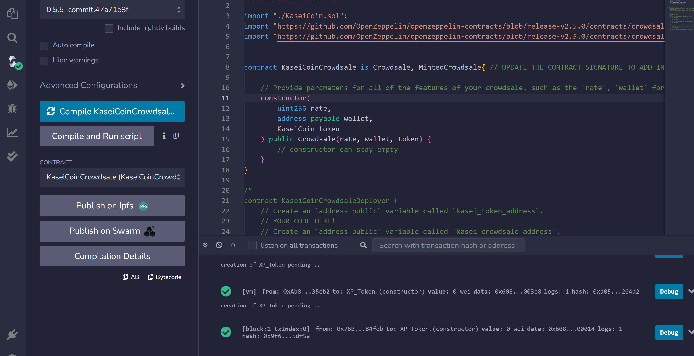
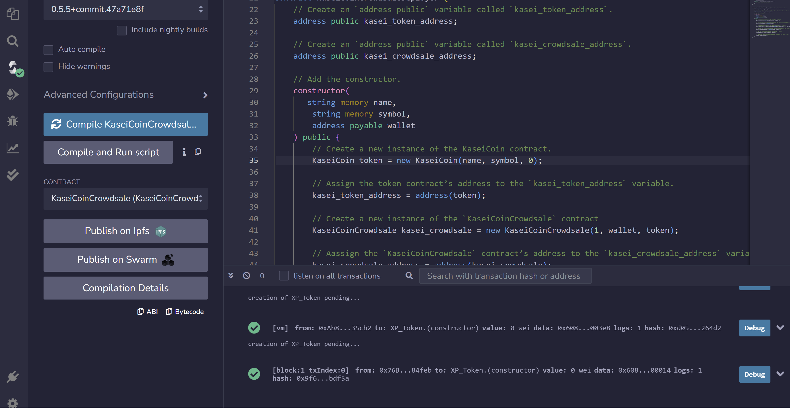

# Mars Monetary System: KAI Crowdsale Project

Welcome to the KaseiCoin project, where we are pioneering the development of a cutting-edge cryptocurrency and blockchain-based monetary system for the first human colony on Mars! "Kasei" means "Mars" in Japanese, and KaseiCoin (KAI) will be the primary digital currency used by Mars residents for various transactions and economic activities.

---

## Technologies

The technologies used in this project include:

   * **Solidity**: The smart contract is written in [Solidity](https://soliditylang.org/), a high-level language for implementing smart contracts on the Ethereum blockchain.

   * **Remix IDE**: Remix IDE is the integrated development environment you used to develop, test, and deploy the smart contract. It provides a user-friendly interface for Ethereum smart contract development.
   
---

## Installation Guide

Install [MetaMask](https://metamask.io/download/):  A crypto wallet and gateway to blockchain apps.

Install [Ganache](https://trufflesuite.com/ganache/): A personal blockchain for Ethereum development.

---


## Usage

To use this platform, follow these steps:

**Clone the Repository:** 

Clone this repository to your local machine using the following command:

   ```bash
   git clone https://github.com/AnaFilipaMartelo/Challenge21.git
  ```

**Open the Remix IDE:** 

 The Remix IDE is available in both web and desktop versions. We'll use the Web version of the [Remix IDE](https://remix.ethereum.org/). 
 
 Upload to Solidity the files ```KaseiCoinCrowdsale.sol``` and ```KaseiCoin.sol```. 

**Deploy the Crowdsale to a Local Blockchain :** 

 Deployment of the contract to a local blockchain with Remix, MetaMask, and Ganache. 

 Follow the following demostration: 

 ---

 ## Evaluation Evidence

   

 

 
